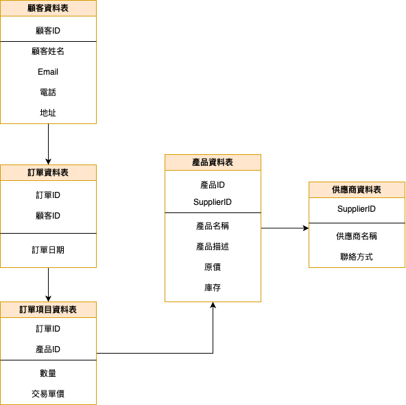

## Lab-05_2：線上商店訂單系統
### 情境
* 一家小型線上商店需要一個系統來管理顧客、產品和訂單。

### 初步收集的資料可能包含
* 顧客：顧客ID、顧客姓名、Email、電話號碼、完整送貨地址 (街道、城市、郵遞區號、國家)。
* 產品：產品ID、產品名稱、產品描述、單價、庫存數量、供應商名稱、供應商聯絡方式。
* 訂單：訂單ID、顧客ID、顧客姓名、訂單日期、訂單總金額、產品ID (多個)、產品名稱 (多個)、購買數量 (對應每個產品)、單價 (對應每個產品)。

### 未正規化前的資料表
| 訂單ID | 顧客ID | 顧客姓名 | Email     | 電話 | 地址         | 訂單日期   | 訂單總金額 | 產品ID | 產品名稱 | 單價 | 數量 | 庫存 | 供應商名稱 | 聯絡方式     |
|--------|--------|----------|-----------|------|--------------|------------|------------|--------|----------|------|------|------|--------------|--------------|
| O001   | C001   | 張三     | a@x.com   | 0912 | 台北市信義區 | 2024-05-01 | 2000       | P001   | 滑鼠     | 500  | 2    | 100  | AAA科技       | 02-12345678   |
| O001   | C001   | 張三     | a@x.com   | 0912 | 台北市信義區 | 2024-05-01 | 2000       | P002   | 鍵盤     | 1000 | 1    | 50   | BBB科技       | 02-23456789   |
| O002   | C002   | 李四     | b@x.com   | 0987 | 高雄市左營區 | 2024-05-03 | 1000       | P003   | 螢幕     | 1000 | 1    | 20   | CCC科技       | 07-12345678   |

### 函數相依性
| 函數相依性                                | 
|-----------------------------------------|
| 顧客ID → 顧客姓名, 地址, Email, 電話       | 
| 產品ID → 名稱, 描述, 單價, 庫存, 供應商資訊 | 
| 供應商名稱 → 聯絡方式                     |
| 訂單ID → 顧客ID, 訂單日期, 總金額          |
| 訂單ID → 顧客姓名, 地址                   | 
| (訂單ID, 產品ID) → 購買數量, 單價          |

### 第一正規化（1NF）
#### 顧客資料表
| 顧客ID | 顧客姓名 | Email     | 電話 | 地址         |
|--------|----------|-----------|------|--------------|
| C001   | 張三     | a@x.com   | 0912 | 台北市信義區 |
| C002   | 李四     | b@x.com   | 0987 | 高雄市左營區 |

#### 訂單資料表
| 訂單ID | 顧客ID | 訂單日期   | 訂單總金額 |
|--------|--------|------------|------------|
| O001   | C001   | 2024-05-01 | 2000       |
| O002   | C002   | 2024-05-03 | 1000       |

#### 訂單項目資料表
| 訂單ID | 產品ID | 數量 | 單價 |
|--------|--------|------|------|
| O001   | P001   | 2    | 500  |
| O001   | P002   | 1    | 1000 |
| O002   | P003   | 1    | 1000 |

#### 商品資料表
| 產品ID | 產品名稱 | 產品描述 | 單價 | 庫存數量 | 供應商名稱 |
|--------|----------|------------|------|------------|--------------|
| P001   | 滑鼠     | 無線滑鼠   | 500  | 100        | AAA科技       |
| P002   | 鍵盤     | 機械鍵盤   | 1000 | 50         | BBB科技       |
| P003   | 螢幕     | 27吋螢幕   | 1000 | 20         | CCC科技       |

#### 供應商資料表
| 供應商名稱 | 聯絡方式     |
|--------------|--------------|
| AAA科技       | 02-12345678   |
| BBB科技       | 02-23456789   |
| CCC科技       | 07-12345678   |

### 第一正規化說明
**目的：**
確保每筆資料皆為不可分割的原子值（Atomic），並移除重複欄位群組與多值屬性。

**處理步驟：**
1. 原始表中每筆訂單可包含多項產品 → 出現顧客與訂單資訊重複現象。
2. 分拆出 `Order`（訂單）與 `OrderItem`（訂單項目），確保一列資料只對應一筆訂單明細。
3. 再分離出 `Customer`（顧客）與 `ProductBasic`（產品資料）表，使每筆資料專注於單一主題。

**結果：**
- 各表皆無重複資料群組，所有欄位皆為不可分割的值。
- 為後續 2NF 拆除部分相依性做準備。

### 第二正規化（2NF）
#### 顧客資料表
#### 顧客資料表
| 顧客ID | 顧客姓名 | Email     | 電話 | 地址         |
|--------|----------|-----------|------|--------------|
| C001   | 張三     | a@x.com   | 0912 | 台北市信義區 |
| C002   | 李四     | b@x.com   | 0987 | 高雄市左營區 |

#### 訂單資料表
| 訂單ID | 顧客ID | 訂單日期   | 訂單總金額 |
|--------|--------|------------|------------|
| O001   | C001   | 2024-05-01 | 2000       |
| O002   | C002   | 2024-05-03 | 1000       |

#### 訂單項目資料表
| 訂單ID | 產品ID | 數量 | 單價 |
|--------|--------|------|------|
| O001   | P001   | 2    | 500  |
| O001   | P002   | 1    | 1000 |
| O002   | P003   | 1    | 1000 |

#### 商品資料表
| 產品ID | 產品名稱 | 產品描述 | 單價 | 庫存數量 | 供應商名稱 |
|--------|----------|------------|------|------------|--------------|
| P001   | 滑鼠     | 無線滑鼠   | 500  | 100        | AAA科技       |
| P002   | 鍵盤     | 機械鍵盤   | 1000 | 50         | BBB科技       |
| P003   | 螢幕     | 27吋螢幕   | 1000 | 20         | CCC科技       |

#### 供應商資料表
| 供應商名稱 | 聯絡方式     |
|--------------|--------------|
| AAA科技       | 02-12345678   |
| BBB科技       | 02-23456789   |
| CCC科技       | 07-12345678   |

### 第二正規化說明
**目的：**  
在 1NF 基礎上，**消除部分相依性**，非主鍵欄位必須**完全依賴於主鍵**，不能只依賴主鍵的一部分。

**處理步驟：**
1. 在 1NF 中，`(訂單ID, 產品ID)` 構成訂單明細的複合主鍵。
2. 發現有些欄位（如顧客姓名、產品名稱、供應商資訊）**只依賴顧客ID 或 產品ID**，不是整個主鍵。
3. 因此，我們拆出以下主題資料表：
   - `Customer`（顧客）
   - `Product`（產品）
   - `Supplier`（供應商）
   - `Order`（訂單資料）
   - `OrderItem`（訂單項目資料）

**結果：**
- 每筆資料表的欄位都完全依賴主鍵。
- 減少重複資料，提高一致性與可維護性。

### 第三正規化（3NF）
#### 訂單資料表
| 訂單ID | 顧客ID | 訂單日期   |
|--------|--------|------------|
| O001   | C001   | 2024-05-01 |
| O002   | C002   | 2024-05-03 |

#### 訂單項目資料表
| 訂單ID | 產品ID | 數量 | 交易單價 |
|--------|--------|------|------------|
| O001   | P001   | 2    | 500        |
| O001   | P002   | 1    | 1000       |
| O002   | P003   | 1    | 1000       |

#### 顧客資料表
| 顧客ID | 顧客姓名 | Email     | 電話 | 地址         |
|--------|----------|-----------|------|--------------|
| C001   | 張三     | a@x.com   | 0912 | 台北市信義區 |
| C002   | 李四     | b@x.com   | 0987 | 高雄市左營區 |

#### 產品資料表
| 產品ID | 產品名稱 | 產品描述 | 原價 | 庫存 | SupplierID |
|--------|----------|------------|------|------|-------------|
| P001   | 滑鼠     | 無線滑鼠   | 500  | 100  | S001        |
| P002   | 鍵盤     | 機械鍵盤   | 1000 | 50   | S002        |
| P003   | 螢幕     | 27吋螢幕   | 1000 | 20   | S003        |

#### 供應商資料表
| SupplierID | 供應商名稱 | 聯絡方式     |
|------------|--------------|--------------|
| S001       | AAA科技       | 02-12345678   |
| S002       | BBB科技       | 02-23456789   |
| S003       | CCC科技       | 07-12345678   |

### 第三正規化說明
**目的：**  
在 2NF 基礎上，**消除傳遞相依性**，非主鍵欄位不能依賴於其他非主鍵欄位。

**處理步驟：**
1. 在 2NF 的 `Product` 表中，`供應商聯絡方式` 依賴於 `供應商名稱`，而 `供應商名稱` 又依賴於主鍵 `產品ID`，構成**傳遞相依性**。
2. 根據 3NF 規則，應將 `供應商名稱 → 聯絡方式` 的相依性移出，建立獨立的 `Supplier` 表。
3. 為避免 `供應商名稱` 重複出現且非唯一，新增 `SupplierID` 作為主鍵，並以此連接 `Product` 表。

**結果：**
- 所有非主鍵欄位皆直接依賴主鍵。
- 修改供應商聯絡資訊時，只需改供應商表一筆資料，避免不一致。
### BCNF 正規化
#### 訂單資料表
| 訂單ID | 顧客ID | 訂單日期   |
|--------|--------|------------|
| O001   | C001   | 2024-05-01 |
| O002   | C002   | 2024-05-03 |

#### 訂單項目資料表
| 訂單ID | 產品ID | 數量 | 交易單價 |
|--------|--------|------|------------|
| O001   | P001   | 2    | 500        |
| O001   | P002   | 1    | 1000       |
| O002   | P003   | 1    | 1000       |

#### 顧客資料表
| 顧客ID | 顧客姓名 | Email     | 電話 | 地址         |
|--------|----------|-----------|------|--------------|
| C001   | 張三     | a@x.com   | 0912 | 台北市信義區 |
| C002   | 李四     | b@x.com   | 0987 | 高雄市左營區 |

#### 產品資料表
| 產品ID | 產品名稱 | 產品描述 | 原價 | 庫存 | SupplierID |
|--------|----------|------------|------|------|-------------|
| P001   | 滑鼠     | 無線滑鼠   | 500  | 100  | S001        |
| P002   | 鍵盤     | 機械鍵盤   | 1000 | 50   | S002        |
| P003   | 螢幕     | 27吋螢幕   | 1000 | 20   | S003        |

#### 供應商資料表
| SupplierID | 供應商名稱 | 聯絡方式     |
|------------|--------------|--------------|
| S001       | AAA科技       | 02-12345678   |
| S002       | BBB科技       | 02-23456789   |
| S003       | CCC科技       | 07-12345678   |

### BCNF 正規化說明
**目的：**  
進一步強化正規化，要求每一個**決定項**都是**超鍵（Superkey）**。

**處理步驟：**
1. 雖然在 3NF 階段已經將 `聯絡方式` 從 `Product` 表移至 `Supplier` 表，  
   但 `供應商名稱 → 聯絡方式` 的相依關係仍違反 BCNF，因「供應商名稱」不是唯一識別。
2. 為解決此問題，我們：
   - 建立唯一識別用的 `SupplierID` 作為供應商表的主鍵。
   - 將 `Product` 表中的「供應商名稱」改為連接 `SupplierID`。
3. 所有函數相依中的決定項（Determinant）現在皆為主鍵或超鍵，完全符合 BCNF 規範。

**結果：**
- 資料表不僅符合 3NF，更消除了所有非超鍵的決定項。
- 提升資料庫一致性、安全性與可擴充性。

### 實體關係圖 (ERD)
