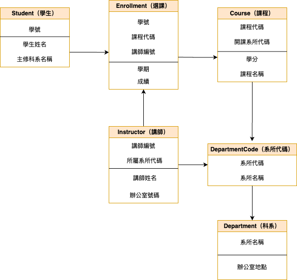

## Lab-05_3：大學課程註冊系統
### 情境
* 設計一個大學課程註冊系統的資料庫。系統需管理學生、課程、講師以及學生的選課記錄。

### 初步收集的資料可能包含
* 學生：學號、學生姓名、主修科系名稱、主修科系辦公室地點。
* 課程：課程代碼、課程名稱、學分數、開課系所代碼、開課系所名稱。
* 講師：講師編號、講師姓名、講師所屬系所代碼、講師所屬系所名稱、講師辦公室號碼。
* 選課記錄：學號、學生姓名、課程代碼、課程名稱、學期、授課講師編號、授課講師姓名、成績。

### 假設
* 一位講師可能教授多門課程，一門課程也可能由多位講師講授 (例如，不同班級或共同授課)。
* 學生選修特定學期的特定課程，由特定講師授課。

### 函數相依性分析
| 函數相依性                                 |
|--------------------------------------------|
| 學號 → 學生姓名, 主修科系名稱              |
| 主修科系名稱 → 主修科系地點                |
| 課程代碼 → 課程名稱, 學分, 開課系所代碼   |
| 開課系所代碼 → 開課系所名稱               |
| 講師編號 → 講師姓名, 所屬系所代碼, 辦公室號碼 |
| 所屬系所代碼 → 所屬系所名稱               |
| (學號, 課程代碼, 學期, 講師編號) → 成績   |

### 未正規化前資料表
| 學號 | 學生姓名 | 主修科系名稱 | 主修科系地點 | 課程代碼 | 課程名稱 | 學分 | 開課系所代碼 | 開課系所名稱 | 學期 | 講師編號 | 講師姓名 | 所屬系所代碼 | 所屬系所名稱 | 辦公室號碼 | 成績 |
|------|----------|----------------|----------------|----------|----------|------|----------------|----------------|--------|----------|----------|----------------|----------------|--------------|--------|
| S001 | 林小明   | 資訊工程學系     | 工學院大樓303     | CS101    | 程式設計     | 3    | CS             | 資訊工程學系     | 2024春 | T001     | 張老師     | CS             | 資訊工程學系     | R210         | 85     |
| S001 | 林小明   | 資訊工程學系     | 工學院大樓303     | MATH201  | 微積分       | 3    | MATH           | 數學系         | 2024春 | T002     | 李老師     | MATH           | 數學系         | M101         | 92     |
| S002 | 王小美   | 數學系         | 理學院大樓110     | CS101    | 程式設計     | 3    | CS             | 資訊工程學系     | 2024春 | T001     | 張老師     | CS             | 資訊工程學系     | R210         | 78     |

### 第一正規化（1NF）
| 學號 | 學生姓名 | 主修科系名稱 | 主修科系地點 | 課程代碼 | 課程名稱 | 學分 | 開課系所代碼 | 開課系所名稱 | 學期 | 講師編號 | 講師姓名 | 所屬系所代碼 | 所屬系所名稱 | 辦公室號碼 | 成績 |
|------|----------|----------------|----------------|----------|----------|------|----------------|----------------|--------|----------|----------|----------------|----------------|--------------|--------|
| S001 | 林小明   | 資訊工程學系     | 工學院大樓303     | CS101    | 程式設計     | 3    | CS             | 資訊工程學系     | 2024春 | T001     | 張老師     | CS             | 資訊工程學系     | R210         | 85     |
| S001 | 林小明   | 資訊工程學系     | 工學院大樓303     | MATH201  | 微積分       | 3    | MATH           | 數學系         | 2024春 | T002     | 李老師     | MATH           | 數學系         | M101         | 92     |
| S002 | 王小美   | 數學系         | 理學院大樓110     | CS101    | 程式設計     | 3    | CS             | 資訊工程學系     | 2024春 | T001     | 張老師     | CS             | 資訊工程學系     | R210         | 78     |

### 第一正規化說明
**目的：** 消除重複欄位與多值屬性，確保欄位為不可再分的 Atomic 值。

**處理：**
- 每一列只對應一筆學生選課資料
- 移除多值欄位（例如多位講師）
- 所有資料皆為原子值

### 第二正規化（2NF）
#### Student（學生）
| 學號 | 學生姓名 | 主修科系名稱 |
|------|----------|----------------|
| S001 | 林小明   | 資訊工程學系     |
| S002 | 王小美   | 數學系         |

#### Department（科系）
| 系所名稱     | 辦公室地點     |
|--------------|----------------|
| 資訊工程學系   | 工學院大樓303     |
| 數學系       | 理學院大樓110     |

#### Course（課程）
| 課程代碼 | 課程名稱 | 學分 | 開課系所代碼 |
|----------|----------|------|----------------|
| CS101    | 程式設計     | 3    | CS             |
| MATH201  | 微積分       | 3    | MATH           |

#### DepartmentCode（系所代碼）
| 系所代碼 | 系所名稱     |
|----------|--------------|
| CS       | 資訊工程學系   |
| MATH     | 數學系         |

#### Instructor（講師）
| 講師編號 | 講師姓名 | 所屬系所代碼 | 辦公室號碼 |
|----------|----------|----------------|--------------|
| T001     | 張老師     | CS             | R210         |
| T002     | 李老師     | MATH           | M101         |

#### Enrollment（選課）
| 學號 | 課程代碼 | 學期  | 講師編號 | 成績 |
|------|----------|--------|----------|------|
| S001 | CS101    | 2024春 | T001     | 85   |
| S001 | MATH201  | 2024春 | T002     | 92   |
| S002 | CS101    | 2024春 | T001     | 78   |

### 第二正規化說明
**目的：** 消除部分相依性，非主鍵欄位必須完全依賴整個複合主鍵。

**處理：**
- 主鍵為 (學號, 課程代碼, 學期, 講師編號)
- 將只依賴「學號」的學生資訊、只依賴「課程代碼」的課程資訊等拆表

### 第三正規化（3NF）
#### Student（學生）
| 學號 | 學生姓名 | 主修科系名稱 |
|------|----------|----------------|
| S001 | 林小明   | 資訊工程學系     |
| S002 | 王小美   | 數學系         |

#### Department（科系）
| 系所名稱     | 辦公室地點     |
|--------------|----------------|
| 資訊工程學系   | 工學院大樓303     |
| 數學系       | 理學院大樓110     |

#### Course（課程）
| 課程代碼 | 課程名稱 | 學分 | 開課系所代碼 |
|----------|----------|------|----------------|
| CS101    | 程式設計     | 3    | CS             |
| MATH201  | 微積分       | 3    | MATH           |

#### DepartmentCode（系所代碼）
| 系所代碼 | 系所名稱     |
|----------|--------------|
| CS       | 資訊工程學系   |
| MATH     | 數學系         |

#### Instructor（講師）
| 講師編號 | 講師姓名 | 所屬系所代碼 | 辦公室號碼 |
|----------|----------|----------------|--------------|
| T001     | 張老師     | CS             | R210         |
| T002     | 李老師     | MATH           | M101         |

#### Enrollment（選課）
| 學號 | 課程代碼 | 學期  | 講師編號 | 成績 |
|------|----------|--------|----------|------|
| S001 | CS101    | 2024春 | T001     | 85   |
| S001 | MATH201  | 2024春 | T002     | 92   |
| S002 | CS101    | 2024春 | T001     | 78   |

### 第三正規化說明
**目的：** 消除傳遞相依性，非主鍵欄位不得依賴其他非主鍵欄位。

**處理：**
- 已將所有資訊拆分至只依賴主鍵的表格中
- 像「系所名稱 → 辦公室地點」、「講師編號 → 所屬系所代碼 → 系所名稱」這類傳遞相依均已解開

### BCNF 正規化
#### Student（學生）
| 學號 | 學生姓名 | 主修科系名稱 |
|------|----------|----------------|
| S001 | 林小明   | 資訊工程學系     |
| S002 | 王小美   | 數學系         |

#### Department（科系）
| 系所名稱     | 辦公室地點     |
|--------------|----------------|
| 資訊工程學系   | 工學院大樓303     |
| 數學系       | 理學院大樓110     |

#### Course（課程）
| 課程代碼 | 課程名稱 | 學分 | 開課系所代碼 |
|----------|----------|------|----------------|
| CS101    | 程式設計     | 3    | CS             |
| MATH201  | 微積分       | 3    | MATH           |

#### DepartmentCode（系所代碼）
| 系所代碼 | 系所名稱     |
|----------|--------------|
| CS       | 資訊工程學系   |
| MATH     | 數學系         |

#### Instructor（講師）
| 講師編號 | 講師姓名 | 所屬系所代碼 | 辦公室號碼 |
|----------|----------|----------------|--------------|
| T001     | 張老師     | CS             | R210         |
| T002     | 李老師     | MATH           | M101         |

#### Enrollment（選課）
| 學號 | 課程代碼 | 學期  | 講師編號 | 成績 |
|------|----------|--------|----------|------|
| S001 | CS101    | 2024春 | T001     | 85   |
| S001 | MATH201  | 2024春 | T002     | 92   |
| S002 | CS101    | 2024春 | T001     | 78   |

### BCNF 正規化說明
**目的：** 消除所有決定項不是超鍵的函數相依性。

**處理：**
- 確認所有函數相依中的「決定項（LHS）」皆為超鍵
- 若 `講師姓名 → 講師辦公室` 這類存在，則需建立唯一鍵（如講師編號）

**已做調整：**
- Instructor 表以 `講師編號` 為主鍵（超鍵）
- Department 表以 `系所名稱` 或代碼為主鍵
- Enrollment 的複合主鍵為 (學號, 課程代碼, 學期, 講師編號)，確保無決定項違反超鍵規則
### 分析與說明
#### 挑戰一：複合主鍵的設計與相依性拆解
在設計選課記錄（Enrollment）時，我們必須考慮以下條件：

- 學生選修某一課程，**每學期可能由不同講師授課**（例如 A 班與 B 班）
- 相同課程可重修，因此「學號 + 課程代碼」無法唯一識別一筆記錄

因此，必須將主鍵設為複合鍵 `(學號, 課程代碼, 學期, 講師編號)`，這在設計上較繁瑣，但能準確描述每筆選課行為。

#### 挑戰二：BCNF 要求所有決定項皆為超鍵
例：
- `供應商名稱 → 聯絡方式`（在商品供應類系統中常見）
- 本系統中出現類似關係：`講師姓名 → 辦公室號碼`、`科系名稱 → 地點`

這些欄位並非主鍵，也非唯一值（講師姓名可能重複），所以若我們錯誤使用「非超鍵作為決定項」，將會違反 BCNF。

解法：
- 所有表格都改採用 **唯一識別鍵**（如：講師編號、課程代碼、學號等）作為主鍵與關聯依據。
- 避免使用可重複的自然屬性（如：姓名、系所名稱）作為主鍵或關聯鍵。

#### 設計決策說明
選擇 **正規化至 BCNF**，理由如下：
- 本案例屬於學術系統，資料結構變動可能性高，應以 **結構穩定、資料一致性優先**。
- 各主題資料表均有清楚的唯一識別鍵（如學號、課程代碼、講師編號），便於達成 BCNF 要求。
- 若日後需考量效能，可於應用層或查詢設計中進行 JOIN 優化或部分反正規化。

#### 總結
* BCNF 有效提升資料一致性與系統可維護性，雖有些許結構複雜化，但在教育或長期系統中是一個更穩定的設計選擇。

### 實體關係圖 (ERD)
